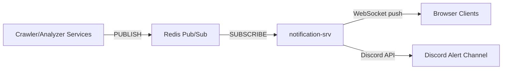
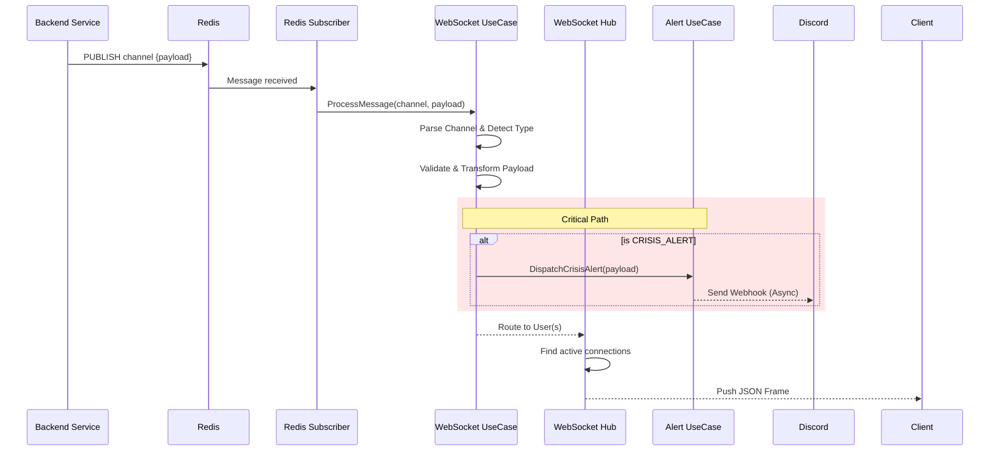

# Notification Service — Technical Documentation

## 1. Overview

**`notification-srv`** is a **real-time notification hub** written in Go, serving the **SMAP** (Social Media Analytics Platform). It acts as a one-way bridge pushing updates from backend services to client dashboards via WebSocket, and critical alerts to Discord.

> [!IMPORTANT]
> The service is **Push-Only**. It does not handle client requests beyond the initial WebSocket handshake/upgrade.

---

## 2. Architecture Domains

The service is divided into two primary domains:

### 2.1 WebSocket Domain (`internal/websocket`)

Handles real-time updates to user dashboards.

- **Role**: Connection management, Message Transformation, Routing.
- **Input**: Redis Pub/Sub messages.
- **Output**: JSON payloads pushed to connected WebSockets.

### 2.2 Alert Domain (`internal/alert`)

Handles critical system and business alerts.

- **Role**: Dispatching formatted alerts to external channels.
- **Input**: Specific message types (e.g., `CRISIS_ALERT`) or direct internal calls.
- **Output**: Rich Embed messages to Discord Webhooks.

---

## 3. Business Logic Flow

### 3.1 Authentication

- **Mechanism**: JWT via **HttpOnly Cookie** (`smap_auth_token`) or Query Param (`?token=...`).
- **Validation**:
  - Token is verified against the Identity Service secret.
  - `UserID` is extracted from the token claims.
  - Connection is rejected if token is invalid or expired.

### 3.2 Message Processing Pipeline

---

## 4. Message Types & Formats

The service supports 4 core message types for the new Analytics Platform.

### 4.1 Data Onboarding (`DATA_ONBOARDING`)

Updates on the status of connecting new data sources (e.g., linking a TikTok account).

| Field | Type | Description |
| :--- | :--- | :--- |
| `project_id` | string | Project context |
| `source_name` | string | "My TikTok Page" |
| `status` | string | `PENDING`, `COMPLETED`, `FAILED` |
| `progress` | int | 0-100 |

### 4.2 Analytics Pipeline (`ANALYTICS_PIPELINE`)

Real-time progress of data processing jobs (Crawling -> Cleaning -> Analyzing).

| Field | Type | Description |
| :--- | :--- | :--- |
| `project_id` | string | Project context |
| `current_phase` | string | `CRAWLING`, `ANALYZING`, `INDEXING` |
| `progress` | int | Overall progress (0-100) |
| `estimated_time_ms` | int64 | Remaining time estimate |

### 4.3 Crisis Alert (`CRISIS_ALERT`)

Critical business alerts detected by the system (e.g., negative sentiment spike).
*Note: These are sent to **both** WebSocket (dashboard) and Discord.*

| Field | Type | Description |
| :--- | :--- | :--- |
| `severity` | string | `CRITICAL`, `WARNING`, `INFO` |
| `metric` | string | e.g., "Sentiment Score" |
| `current_value` | float | e.g., -0.85 |
| `threshold` | float | e.g., -0.50 |
| `affected_aspects`| array | ["Service Quality", "Pricing"] |

### 4.4 Campaign Event (`CAMPAIGN_EVENT`)

Lifecycle events for marketing campaigns.

| Field | Type | Description |
| :--- | :--- | :--- |
| `event_type` | string | `CREATED`, `STARTED`, `PAUSED`, `FINISHED` |
| `campaign_name` | string | "Summer Sale 2026" |
| `message` | string | Human-readable description |

---

## 5. Discord Integration (Alert Domain)

The `internal/alert` domain maps internal alerts to rich Discord Embeds.

### Visual Mapping

- **CRITICAL** (Red): Immediate action required (e.g., Crisis detected).
- **WARNING** (Orange): Threshold breaches or high failure rates.
- **INFO** (Blue): Campaign updates.
- **SUCCESS** (Green): Data onboarding completed.
- **FAILURE** (Red): Data onboarding failed.

### Components

- **Title**: Project/Campaign Name.
- **Description**: Summary of the event.
- **Fields**: Key-Value pairs (Metric/Value, Time Window, Action Required).
- **Footer**: Service signature.

---

## 6. Connection Management

- **User Mapping**: One UserID can have multiple connections (tabs/devices).
- **Graceful Shutdown**:
    1. Stop Redis Subscriber.
    2. Close all WebSocket connections with `CloseServiceRestart` code.
    3. Shutdown HTTP Server.

---

**Last Updated**: 17/02/2026
**Version**: 2.0 (Refactored)
