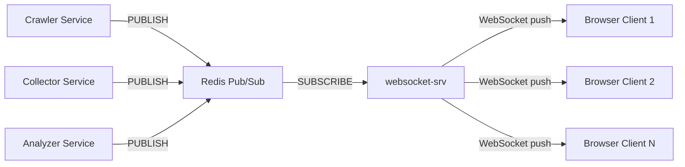
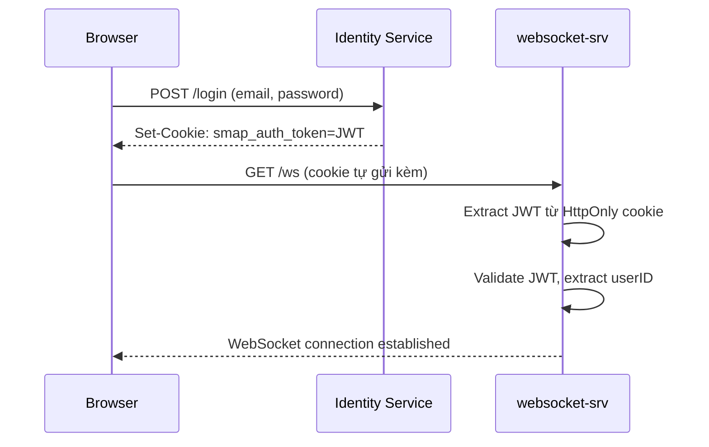
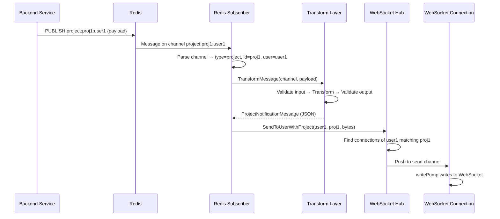
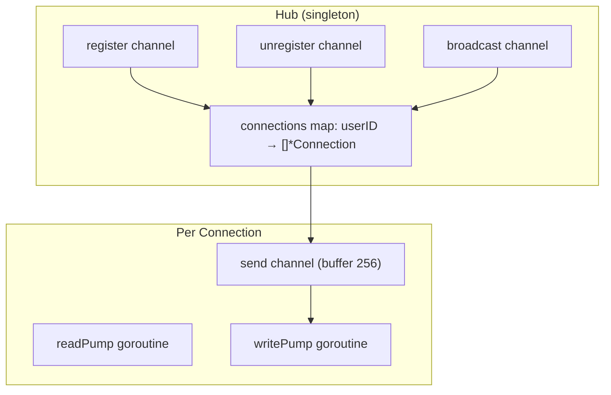

# WebSocket-SRV — Mô tả chi tiết Business Logic

## 1. Tổng quan

**`websocket-srv`** là một **real-time notification hub** được viết bằng Go, phục vụ cho hệ thống **SMAP** (Social Media Analytics Platform) — một đồ án tốt nghiệp tại HCMUT. Service này đóng vai trò **cầu nối một chiều** giữa các backend microservices và trình duyệt web của user thông qua WebSocket.

> [!IMPORTANT]
> Service này **chỉ push messages** tới client, **không xử lý** bất kỳ request nào từ client (read pump chỉ giữ connection alive và detect disconnect).

---

## 2. Business Domain — SMAP là gì?

SMAP là nền tảng phân tích mạng xã hội, hỗ trợ:

- **Crawl** dữ liệu từ TikTok, YouTube, Instagram theo keyword
- **Phân tích** nội dung crawl được (sentiment, engagement, v.v.)
- **Báo cáo** kết quả cho user qua dashboard real-time

Trong bối cảnh đó, `websocket-srv` chịu trách nhiệm **thông báo real-time** về tiến trình crawl/phân tích cho user đang mở dashboard.

---

## 3. Luồng Business Logic chính

### 3.1 Xác thực (Authentication)

- Xác thực qua **HttpOnly Cookie** (`smap_auth_token`) — JWT không bao giờ lộ qua URL
- Hỗ trợ **legacy query param** `?token=...` (deprecated)
- JWT secret phải match với Identity Service

### 3.2 Topic Subscription (Lọc theo Project/Job)

Client kết nối WebSocket có thể truyền thêm query params:

- `?projectId=abc` → chỉ nhận notification của project `abc`
- `?jobId=xyz` → chỉ nhận notification của job `xyz`
- Không truyền → nhận **tất cả** notification

### 3.3 Message Flow — Từ Redis đến Browser

---

## 4. Ba loại Redis Channel

| Pattern       | Mô tả                          | Ví dụ channel              | Xử lý                                                     |
| ------------- | ------------------------------ | -------------------------- | --------------------------------------------------------- |
| `user_noti:*` | Legacy notification chung      | `user_noti:user123`        | Gửi trực tiếp cho tất cả connection của user              |
| `project:*`   | Thông báo tiến trình project   | `project:proj_abc:user123` | Transform → gửi cho connection có filter project matching |
| `job:*`       | Thông báo tiến trình job/crawl | `job:job_xyz:user123`      | Transform → gửi cho connection có filter job matching     |

---

## 5. Hệ thống Message Types

### 5.1 Input (từ Publisher → Redis)

**Project Messages:**

- [ProjectInputMessage](file:///Users/tailung/Workspaces/smap-hcmut/websocket-srv/internal/types/input.go#6-10) — format cũ: `{status, progress}`
- [ProjectPhaseInputMessage](file:///Users/tailung/Workspaces/smap-hcmut/websocket-srv/internal/types/input.go#314-318) — format mới phase-based: `{type, payload: {project_id, status, crawl, analyze, overall_progress_percent}}`

**Job Messages:**

- [JobInputMessage](file:///Users/tailung/Workspaces/smap-hcmut/websocket-srv/internal/types/input.go#12-18) — `{platform, status, batch, progress}`
  - `batch.content_list[]` chứa social media content items (id, text, author, metrics, media, permalink...)

### 5.2 Output (websocket-srv → Browser)

| Type                                                                                                                          | Struct                                                                            | Mô tả                           |
| ----------------------------------------------------------------------------------------------------------------------------- | --------------------------------------------------------------------------------- | ------------------------------- |
| [ProjectNotificationMessage](file:///Users/tailung/Workspaces/smap-hcmut/websocket-srv/internal/types/output.go#6-10)         | `{status, progress}`                                                              | Trạng thái project tổng quan    |
| [ProjectPhaseNotificationMessage](file:///Users/tailung/Workspaces/smap-hcmut/websocket-srv/internal/types/output.go#314-318) | `{type, payload: {project_id, status, crawl, analyze, overall_progress_percent}}` | Tiến trình chi tiết theo phase  |
| [JobNotificationMessage](file:///Users/tailung/Workspaces/smap-hcmut/websocket-srv/internal/types/output.go#12-18)            | `{platform, status, batch, progress}`                                             | Kết quả crawl job theo platform |

### 5.3 Các trạng thái (Enums)

**Project:** `INITIALIZING` → `PROCESSING` → `DONE` / `FAILED` / `PAUSED`

**Job:** `PROCESSING` → `COMPLETED` / `FAILED` / `PAUSED`

**Platform:** `TIKTOK`, `YOUTUBE`, `INSTAGRAM`

---

## 6. Transform Layer — Validation & Normalization

Transform layer ([transformer.go](file:///Users/tailung/Workspaces/smap-hcmut/websocket-srv/internal/transform/transformer.go)) đảm bảo:

1. **Input validation** — kiểm tra format và giá trị hợp lệ trước khi chuyển đổi
2. **Data normalization** — clamp percentage (0-100), clamp ETA ≥ 0
3. **Deduplication** — loại bỏ content items trùng ID trong batch
4. **Output validation** — kiểm tra lại output sau transform
5. **Metrics & Error tracking** — đo latency, đếm success/failure

---

## 7. Security & Rate Limiting

### Authentication

- **HttpOnly Cookie** + **JWT** validation
- CORS environment-aware: production chỉ cho phép `smap.tantai.dev`

### Authorization (Optional)

- [authorizer.go](file:///Users/tailung/Workspaces/smap-hcmut/websocket-srv/internal/auth/authorizer.go): kiểm tra user có quyền access project/job không
- Cached authorization với TTL tự động cleanup

### Rate Limiting (Optional)

- [rate_limiter.go](file:///Users/tailung/Workspaces/smap-hcmut/websocket-srv/internal/auth/rate_limiter.go): giới hạn:
  - Max 10 connections/user
  - Max 3 connections/user/project
  - Max 3 connections/user/job
  - Max 20 new connections/user/minute

---

## 8. Kiến trúc Connection Management

- Mỗi user có thể mở **nhiều connection** (nhiều tab browser)
- Hub duy trì map `userID → []*Connection`
- Mỗi Connection chạy 2 goroutine: [readPump](file:///Users/tailung/Workspaces/smap-hcmut/websocket-srv/internal/websocket/connection.go#100-140) (detect disconnect) + [writePump](file:///Users/tailung/Workspaces/smap-hcmut/websocket-srv/internal/websocket/connection.go#141-195) (push messages + ping/pong)
- **Ping/Pong** keep-alive mỗi 30s, timeout 60s
- Max 10,000 connections tổng

---

## 9. Graceful Shutdown

Shutdown theo thứ tự:

1. **Redis Subscriber** → ngừng nhận message
2. **Hub** → đóng tất cả WebSocket connection
3. **HTTP Server** → stop accepting requests

Timeout 30 giây cho toàn bộ quá trình shutdown.

---

## 10. Tóm tắt

| Khía cạnh          | Chi tiết                                                 |
| ------------------ | -------------------------------------------------------- |
| **Ngôn ngữ**       | Go 1.25+                                                 |
| **Framework**      | Gin (HTTP), gorilla/websocket                            |
| **Message broker** | Redis Pub/Sub (pattern subscribe)                        |
| **Auth**           | JWT via HttpOnly cookie                                  |
| **Vai trò**        | Push-only notification hub                               |
| **Domain**         | Social media analytics (crawl TikTok/YouTube/Instagram)  |
| **Entities**       | Project, Job, Batch, Content, Author, Metrics            |
| **Scalability**    | Stateless, horizontal scaling ready, max 10K connections |
